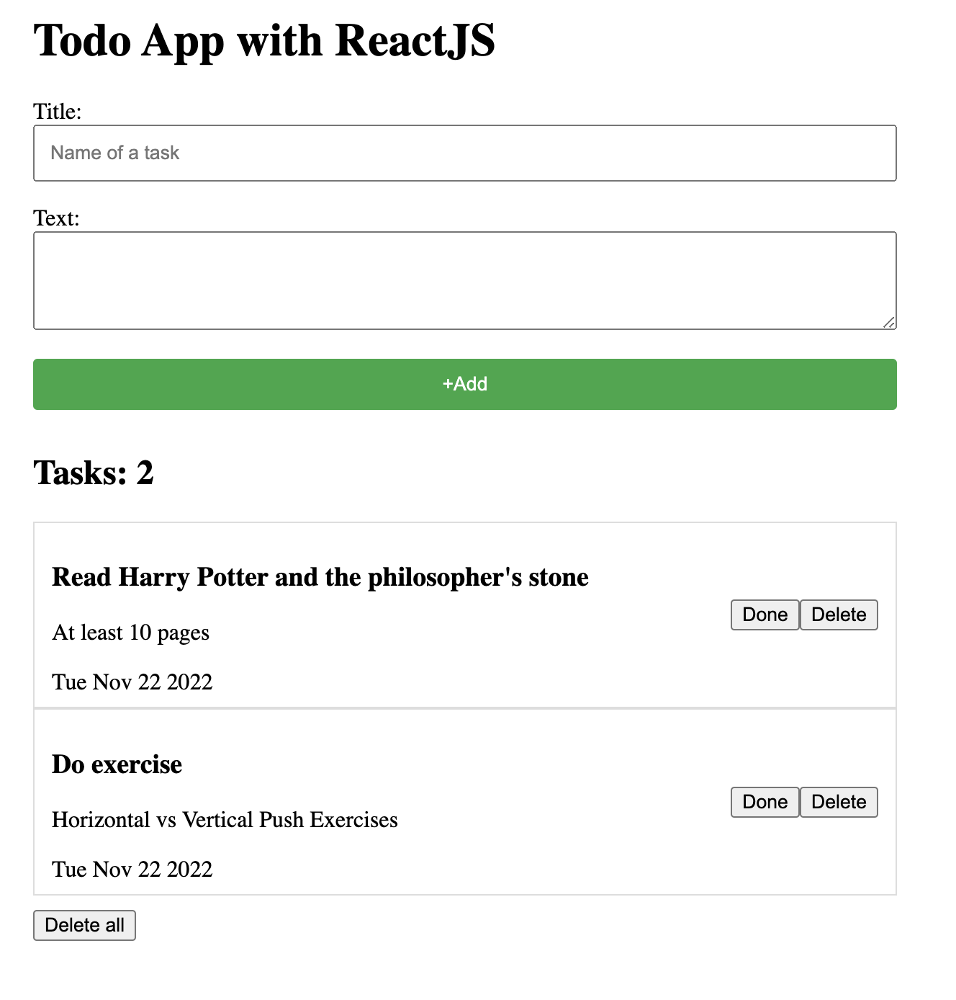

# Simple Todo app using ReactJS and ContextAPI

# Reducer
+ Action, initialData, dispatch, reducer fucntion, useReducer hook.
+ Action - іс әрекет:
1. Тапсырманы қосу - task: {title, status, text}
2. Филтірлеу - тапсырманынң статусын жібереміз
3. Бітті деп белгілеу - тапсырманың индексі
4. Бітте деп барлығын белгілеу - ештене жібермейміз
5. Архивке жіберу - тапсырманың индексі
6. Тапсырманы өшіру - тапсырманың индексі
7. Барлық тапсырманы өшіру - ештене жібермейміз

action = {
    type: "add",
    task: task
}

initialData = алғашқы данныйлар.

Компоненттің күйіне немесе редюсерге жібереді.

function todosReducer(tasks, action){
    if(action.type === 'add){
        return [
            ...tasks,
            actiom.task
        ]
    }
}